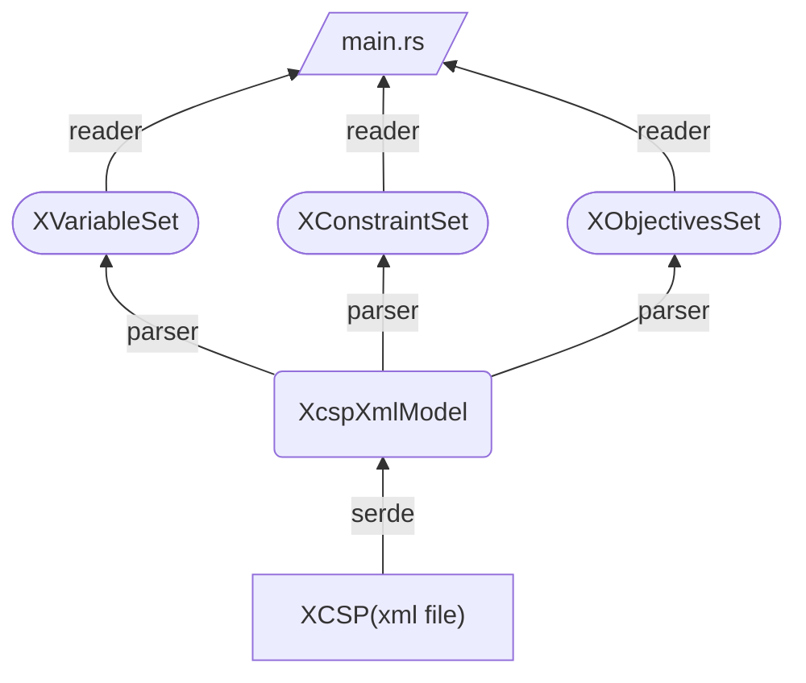
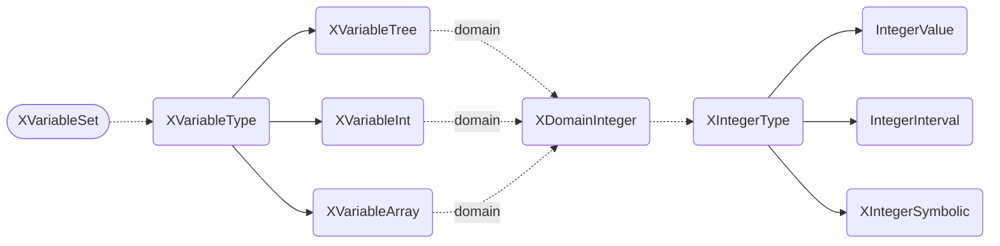
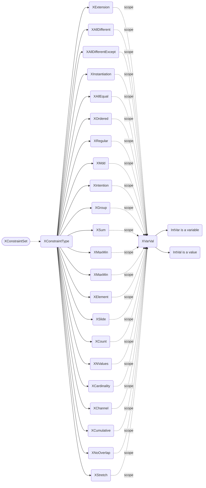
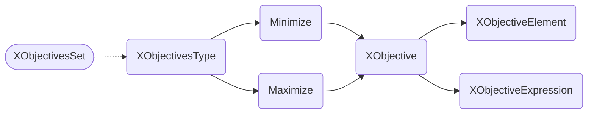

<h1 > <div style="text-align: center;"><b>xcsp3-rust </b></div>  </h1>

[//]: # ([![Crate]&#40;https://img.shields.io/crates/v/quick-xml.svg&#41;]&#40;https://crates.io/crates/quick-xml&#41;)

[](http://xcsp.org)
[](https://github.com/luhanzhen/xcsp3-rust)
[](https://docs.rs/xcsp3-rust)
[](https://blog.rust-lang.org/2023/06/01/Rust-1.70.0.html)
[](https://github.com/luhanzhen/xcsp3-rust/LICENSE)


## Description
### This lib is implemented by rust and is licensed under the MIT license. 
### The purpose of this library is to read XCSP files into rust constraint programming solvers.
### You can learn about the semantics of XCSP3 through this site http://xcsp.org/.
### I will keep improving this code to support more constraints and fix possible bugs.
### If you have something to tell me, feel free to contact me.


## Usage

### Just add the following dependency to your project's Cargo.toml file:

```toml
[dependencies]
xcsp3-rust = "0.1.0"
```

### The library is automatically built and statically linked to your binary.

## Example

```rust
    fn main()
    {
        let xml_file = ".//instances//my-example.xml";
        let model = XcspXmlModel::from_path(xml_file).unwrap();
        let variable = model.build_variables();
        
        println!("variables:");
        for v in variable.iter() {
            println!("\t{}", v);
        }
        
        println!("constraints:");
        for c in model.build_constraints(&variable).iter() {
            println!("\t{}", c);
        }
        
        println!("objectives:");
        for o in model.build_objectives(&variable).iter() {
            println!("\t{}", o);
        }
    }
```

## Architecture Graph

### main architecture

### XVariableSet

### XConstraintSet

### XObjectivesSet


## License
> MIT License

## Author
> luhan zhen

> tip: Maybe my code is not the best, but I will keep improving it to better build our 'CP' community.


